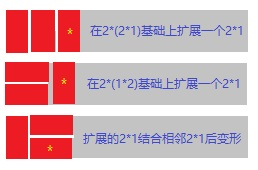

## 题目 10.矩形覆盖
  我们可以用2*1的小矩形横着或者竖着去覆盖更大的矩形。请问用n个2*1的小矩形无重叠地覆盖一个2*n的大矩形，总共有多少种方法？
比如n=3时，2*3的矩形块有3种覆盖方法：

### 解题思路
  
  思路分析：
痛定思痛，还是不能够贪小便宜。用归纳法归纳如下，

（1）当 n < 1时，显然不需要用2*1块覆盖，按照题目提示应该返回 0。

（2）当 n = 1时，只存在一种情况。

  

（3）当 n = 2时，存在两种情况。

  

（4）当 n = 3时，明显感觉到如果没有章法，思维难度比之前提升挺多的。
  

  ... 尝试归纳，本质上 n 覆盖方法种类都是对 n - 1 时的扩展。
  可以明确，n 时必定有 n-1时原来方式与2*1的方块结合。也就是说, f(n) = f(n-1) + ?(暂时无法判断)。

（4）如果我们现在归纳 n = 4，应该是什么形式？

    4.1）保持原来n = 3时内容，并扩展一个 2*1 方块，形式分别为 “| | | |”、“= | |”、“| = |”
    4.2）新增加的2*1 方块与临近的2*1方块组成 2*2结构，然后可以变形成 “=”。于是 n = 4在原来n = 3基础上增加了"| | ="、“= =”。
  再自己看看这多出来的两种形式，是不是只比n = 2多了“=”。其实这就是关键点所在...因为，只要2*1或1*2有相同的两个时，就会组成2*2形式，于是就又可以变形了。

  所以，自然而然可以得出规律： f(n) = f(n-1) + f(n-2)， (n > 2)。

如果看了这一套理论还存在疑惑。可以尝试将题目改成1*3方块覆盖3*n、1*4方块覆盖4*n。
相应的结论应该是：

    （1）1 * 3方块 覆 盖3*n区域：f(n) = f(n-1) + f(n - 3)， (n > 3)
    （2） 1 *4 方块 覆 盖4*n区域：f(n) = f(n-1) + f(n - 4)，(n > 4)
    更一般的结论，如果用1*m的方块覆盖m*n区域，递推关系式为f(n) = f(n-1) + f(n-m)，(n > m)。