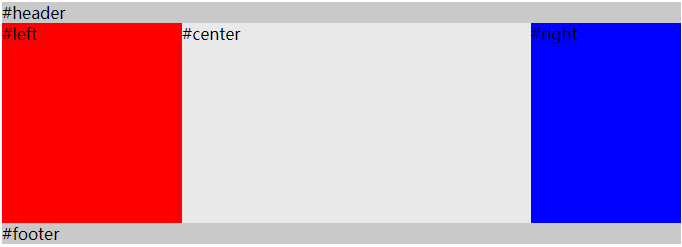
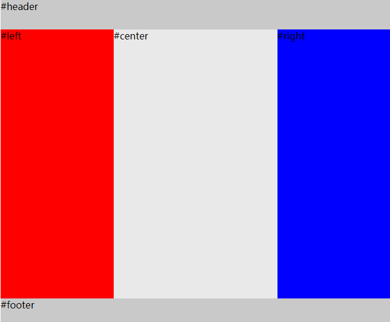

### 圣杯布局



```
<div id="header">#header</div>

  <div id="container">
    <div id="center" class="column">#center</div>
    <div id="left" class="column">#left</div>
    <div id="right" class="column">#right</div>
  </div>

  <div id="footer">#footer</div>
```

实现的效果主要在container中，left 和 rgith固定宽度，center首先渲染，且自适应宽度。

```
    body {
      min-width: 500px;
    }
    #container {
      overflow: auto;        /* BFC */
      padding-left: 180px;
      padding-right: 150px;
    }
    #container .column {
      height: 200px;
      position: relative;
      float: left;
    }
    #center {
      background-color: #e9e9e9;
      width: 100%;
    }
    #left {
      background-color: red;
      width: 180px;
      right: 180px; 
      margin-left: -100%
    }
    #right {
      background-color: blue;
      width: 150px; 
      margin-right: -150px;
    }

    #header, 
    #footer {
      background-color: #c9c9c9;
    }
```

该方案几个注意的点：

1. center元素位于left和right之前，可以让center先渲染，用户首先看到页面的主要内容。
2. container （width:100%）包裹着三栏内容，通过padding-left和padding-right为左右两栏腾出空间。
3. center，left，right都设置一个左浮动（float:left），所以container内部是一个**浮动流**。
4. 通过给 left 元素设置 `margin-left: -100%`，使得left移动到container的左上角，在通过`position：relative； right: 180px`，移动到container的padding-left的位置上去。
5. 给right 元素设置 `margin-right: -150px`，使得它移动到container的padding-right的位置上去。

> ps: margin-left 和 margin-right 利用了浮动流的特性，使得第一行能够同时容纳center，left，right这三个元素。

### 圣杯布局（flexbox实现）



```
<div id="HolyGrail">
  <div id="header">#header</div>

  <div id="container">
    <div id="center" class="column">#center</div>
    <div id="left" class="column">#left</div>
    <div id="right" class="column">#right</div>
  </div>

  <div id="footer">#footer</div>
    body {
      min-width: 550px;  
    }
    #HolyGrail {
      display: flex;
      min-height: 100vh;
      flex-direction: column;
    }
    #container {
      display: flex;
      flex: 1;
    }
    #center {
      background-color: #e9e9e9;
      flex: 1;
    }
    #left {
      background-color: red;
      order: -1;
      width: 150px;
    }
    #right {
      background-color: blue;
      width: 150px;
    }
    #header, 
    #footer {
      height: 50px;
      background-color: #c9c9c9;
    }
```

如果不考虑ie10及以下的浏览器，那么可以使用flex来实现圣杯布局。而且圣杯布局可以通过让container填充高度来使得footer达到一个sticky的效果。
[flex兼容性](https://css-tricks.com/snippets/css/a-guide-to-flexbox/#browser-support)

### 双飞翼布局


圣杯布局和双飞翼布局解决的问题是一样的，就是两边定宽，中间自适应的三栏布局，中间栏要在放在文档流前面以优先渲染。圣杯布局和双飞翼布局解决问题的方案在前一半是相同的，也就是三栏全部float浮动，但左右两栏加上负margin让其跟中间栏div并排，以形成三栏布局。**不同的地方在于**解决中间div内容不被遮挡的思路上面

1. 圣杯布局的为了中间内容不被修改，是通过包裹元素的`padding-left`和`padding-right`来使得内容div置于中间，然后再通过相对定位`position:relative`，配合right或left属性让左右两栏不则当中间内容。
2. 双飞翼布局的解决方案是：通过再中间元素的内部新增一个div用于放置内容，然后通过左右外边距`margin-left`和`margin-right`为左右两栏留出位置。
3. 双飞翼布局多了1个div标签，少用了4个css属性。少用了padding-left，padding-right，左右两个div用相对布局position: relative及对应的right和left，多了margin-left，margin-right。

```
<div id="header">#header</div>

  <div id="container">
    <div id="center" class="column">
      <div id="center-content">#center</div>
    </div>
    <div id="left" class="column">#left</div>
    <div id="right" class="column">#right</div>
  </div>

  <div id="footer">#footer</div>
    body {
      min-width: 500px;  
    }
    #container {
      overflow: auto;        /* BFC */
    }
    #container .column {
      height: 200px;
      float: left;
    }
    #center {
      background-color: #e9e9e9;
      width: 100%;
    }
    #center-content {
      margin-left: 180px;
      margin-right: 150px;
    } 
    #left {
      width: 180px;
      background-color: red;
      margin-left: -100%;
    }
    #right {
      background-color: blue;
      width: 150px;  
<!-- ``` -->