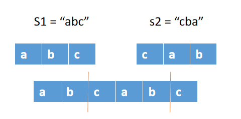

## 题目 面试题 01.09. 字符串轮转
字符串轮转。给定两个字符串s1和s2，请编写代码检查s2是否为s1旋转而成（比如，waterbottle是erbottlewat旋转后的字符串）。

示例1:

 输入：s1 = "waterbottle", s2 = "erbottlewat"
 输出：True
示例2:

 输入：s1 = "aa", s2 = "aba"
 输出：False
提示：

字符串长度在[0, 100000]范围内。
说明:

你能只调用一次检查子串的方法吗？

### 解题思路
  轮转的意思：
  lúnzhuàn
  部首 车 | 笔划 4
  ①旋转；循环：四时轮转。
  ②〈方〉轮流：轮转着值夜班。

  如果 s1 和 s2 轮转
  那么 s2 一定是 s1 + s1 的 子串
  或者 s1 一定是 s2 + s2 的 子串
  